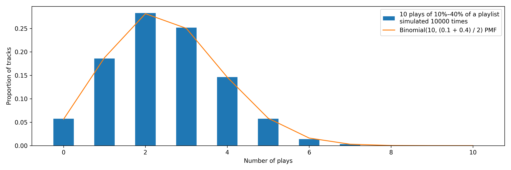

In a nutshell, this script allows "persistent" shuffle by removing tracks from a filtered playlist as you listen to them, so that you can listen to the playlist all the way through.

# Motivation

On Spotify, I like to make long—15 hours or more—playlists of music I'd like to get to know. Then I put the playlists on in the background and absorb the music passively while I work.

I'd like to hear *all* the music on the playlist. But I'm not going to listen to it all at once. And when I hit pause and go listen to something else, then come back to the playlist again, Spotify doesn't "remember" the tracks that I already heard.

If I were listening to each playlist in order, then I could remember the last track I listened to, and then return to it next time I listen to the playlist. But would take a lot of memory and effort and, what's more, I don't want to listen to my playlists in the same order every time.

Instead, I'd rather have my playlists on shuffle. But it's in the nature of randomness that, just by chance, I will hear some tracks much more often than others.

Consider the chart below, where I've simulated listening 10 times to a shuffled playlist of 100 tracks, each time listening to between 10% and 40% of the playlist. (The orange line shows the theoretical distribution that the simulation should follow; you can see that it matches exactly.)[^fn1]

[^fn1]: For simplicity, I'm assuming that Spotify shuffle is uniformly random. But in fact, I don't think it is, which makes the problem worse than I have described. When shuffling tracks, Spotify appears to favor tracks that it A) thinks you particularly like (because you have listened to them before), or B) thinks people like in general (because they have been listened to a lot). That is, it seems to put tend to put these tracks earlier in the queue. This may be good user design (in general, people are probably *pleased* when they put a playlist on and their favorite song comes right on). But it compounds the problem I describe above, because it means that, after (purely by chance) you listen to a track 5, 6, or 7 times, Spotify will put it in the queue ahead of the tracks that you've only heard once or twice, or not at all.

As you can see , the number of times each track is heard varies widely. Nearly 25% of tracks are heard only once or less. A similar proportion are heard four or more times.

I solved this problem for myself, but I needed to write a Python script to do so. This script works with pairs of playlists, a "source" playlist and a "filtered" playlist. The "filtered" playlist is empty at first. Whenever the "filtered" playlist is empty, the script puts all of the songs from the "source" playlist onto it. Then each time I listen to a track from the "filtered" playlist, the script removes it from that playlist. The result is that I can listen to the filtered playlist all the way through.

# Installation

1. Clone or download this repository.
2. In the repository directory, run `pip install -r requirements.txt`.

# Usage

In order to use the script, you'll need to create a Spotify "App" which allows you to access the Spotify API in order to control your Spotify account. You'll find directions for doing so [here](https://developer.spotify.com/documentation/web-api/concepts/apps).

To launch the script, run `python spotify_filter_played.py`. When the script, it will prompt you for a few pieces of information.

1. First, it asks for the client ID for your app.
2. Then it asks for the client secret.
3. Then, a browser window will open and Spotify asks if you want to approve the permissions. Say yes.
4. You will then be redirected to `example.com`. Paste the full URL (`https://example.com/callback?code=...`) into the script.
5. You will then be prompted to enter a source playlist. This can be any playlist in Spotify. Go to the playlist, and then click the `...` menu and select `Share > Copy link to playlist`. Then paste the result into the script.
6. You will next be prompted to enter a destination (i.e., filtered) playlist. You should create a new empty playlist. Then again paste the link to the new playlist into the script.

If you want to add more playlists, use the `--new-playlist` or `-n` flag to the script, and repeat 5. and 6.

If you want to use this script, chances are you want to set the script to run automatically on a regular basis: I use [`cron`](https://en.wikipedia.org/wiki/Cron) to run the script every 10 minutes.
